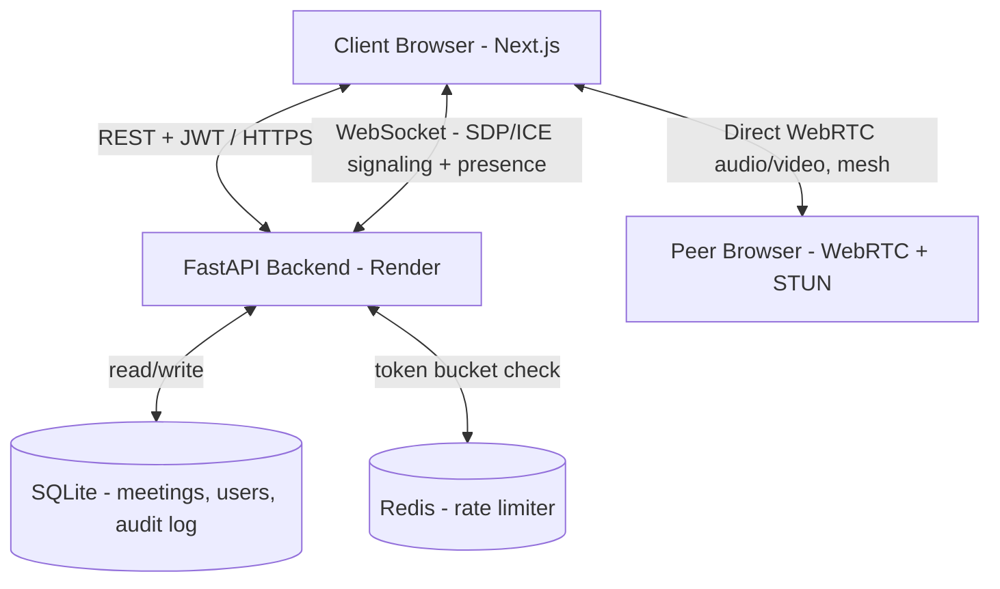

# 🚀 Zoom One — Full-Stack Video Conferencing Platform

A real-time video conferencing platform built with a pragmatic, resource-aware media architecture — WebRTC mesh with WebSocket signaling for the current deployment footprint, with a documented migration path to an SFU (mediasoup) as the room-size and infra budget grow.

🌐 **Live Production Link**: [https://zoom-clone-amber-three.vercel.app](https://zoom-clone-amber-three.vercel.app)  
🎥 **Sample Live Meeting**: [https://zoom-clone-amber-three.vercel.app/meeting/lWRPRNI-cE7s](https://zoom-clone-amber-three.vercel.app/meeting/lWRPRNI-cE7s)

---

## 🔥 Key Highlights & Core Features

### 🎥 1. Real-Time Video & Audio — WebRTC Mesh + WebSocket Signaling
- **Direct peer-to-peer WebRTC** between participants, with **Google STUN** (`stun:stun.l.google.com:19302`) for NAT traversal.
- **FastAPI WebSocket signaling channel**: exchanges SDP offers/answers and ICE candidates between peers per meeting room — no separate media server process, so no dedicated media-server memory/CPU footprint.
- **Dynamic Video Grid**: auto-adjusts layout (1x1, 2x2, grid) based on participant count, with active-speaker indicators.
- **Media Controls**: 1-click mute mic / toggle camera (local `AudioTrack`/`VideoTrack` enable/disable).
- **Live Connection Status Badge**: reflects actual peer connection state, not just socket connectivity.

### 🔐 2. Authentication & User Management (bonus scope)
- **JWT Authentication**: signup/login via PyJWT + bcrypt (passlib) password hashing.
- **1-Click Guest Access**: auto-generated `Guest #XXXX` accounts for zero-friction evaluation.
- **Protected Routes**: Next.js middleware redirects unauthenticated visitors to `/login`.
- Per the assignment spec, auth is optional — a default logged-in user is assumed when this is disabled.

### 📅 3. Meeting Scheduling & Management
- **Instant Meetings**: 1-click creation with auto-generated short meeting codes (8–11 alphanumeric chars).
- **Scheduled Meetings**: title, description, start time, duration.
- **Upcoming & Past Meetings Dashboard**, backed by SQLite via async SQLAlchemy.
- **Invite Link Generator** with 1-click copy.

### 🎛️ 4. In-Meeting Controls & Host Management
- **Host Privileges**: host badge + admin controls, enforced server-side by checking `is_host` on the participant record before applying an action — not just hidden in the UI.
- **Mute All**: host action broadcasts a mute event to all peers in the room over the signaling socket.
- **Remove Participant**: closes that participant's peer connection and evicts them from the room's participant list.
- **Slide-in Participant Sidebar**: live list of participants, host status, audio/video state.

### 📊 5. Rate Limiting, Audit Logging & System Health
- **Redis-backed Token Bucket Rate Limiting**: each client (by IP or JWT subject) gets a bucket in Redis (`capacity: 100`, `refill: 10 tokens/sec`), checked atomically via a Lua script (`EVAL`) so limits hold correctly under concurrent FastAPI workers/processes.
- **API Audit Logs**: meeting creation, join/leave events, client IP, timestamps — persisted to SQLite for traceability.
- **Health Checks**: `/health` and root endpoints for load balancer / uptime monitoring.

---

## 🧭 Design Decisions & Trade-offs

**Why WebRTC mesh + WebSocket signaling instead of mediasoup, for now:**  
mediasoup workers are CPU/memory-hungry processes that need to stay resident per active room — that doesn't fit comfortably inside Render's free/low tier memory limits (512MB class instances), and a media server crashing under memory pressure is worse than not having one. For the current scale target (small meetings, a handful of participants), a WebRTC mesh with lightweight WebSocket signaling through FastAPI has effectively zero server-side media footprint — the server only ever handles small JSON signaling messages, never touches raw RTP streams. This was the right trade-off for the current hosting budget, at the cost of mesh not scaling cleanly past ~4-5 participants per room (bandwidth grows O(n²) client-side). The system is architected so this is a swap-in change, not a rewrite: see **Future Scope** below.

---

## 🛠️ Technology Stack

| Layer | Technology |
|---|---|
| Frontend Framework | Next.js 14 (App Router, TypeScript) |
| Styling & UI | Tailwind CSS, Lucide React Icons |
| Real-Time Media | WebRTC (peer-to-peer mesh) + Google STUN |
| Signaling | FastAPI WebSockets (SDP/ICE exchange, presence sync) |
| Backend API | Python, FastAPI + Uvicorn |
| Database & ORM | SQLite + SQLAlchemy 2.0 Async (aiosqlite) |
| Rate Limiting | Redis (token bucket, atomic Lua script) |
| Authentication (bonus) | PyJWT + Passlib (bcrypt) |
| Deployment | Vercel (frontend) · Render (FastAPI backend) |

---

## 🏗️ System Architecture



**Request flow:**
1. **REST handshake** — client hits FastAPI to create/join/schedule a meeting; every request passes through the Redis token-bucket rate limiter before touching the DB.
2. **WebSocket signaling** — once inside a room, each client opens a WebSocket to FastAPI, which relays SDP offers/answers and ICE candidates between peers and keeps the participant list in sync.
3. **P2P media** — actual audio/video flows directly between peer browsers over WebRTC once ICE negotiation completes — the FastAPI server never touches raw media, keeping server-side resource usage minimal regardless of call volume.

### Why Redis for rate limiting instead of in-memory
An in-memory token bucket only works correctly with a single backend process. The moment FastAPI runs behind multiple Uvicorn workers or multiple instances, each process gets its own bucket and the real limit becomes `configured_limit × worker_count`. Redis gives a single shared bucket per client, checked atomically so concurrent requests can't race past the limit.

---

## 🗄️ Database Schema (SQLite)

- **User** — id, name, email, password_hash (if auth enabled), avatar_url, created_at
- **Meeting** — id, meeting_code (unique), title, description, host_id (fk), type (instant/scheduled), status, scheduled_start, duration_minutes, invite_link
- **Participant** — id, meeting_id (fk), display_name, user_id (nullable, guests join by name only), joined_at, left_at, is_host, is_muted
- **AuditLog** — id, event_type (create/join/leave), meeting_id (fk), client_ip, timestamp

---

## 🔭 Future Scope

- **mediasoup SFU migration**: swap the mesh + WebSocket signaling layer for a mediasoup-based SFU once hosting supports dedicated media-server memory/CPU (Fly.io/VPS with open UDP/TCP RTP port range) — needed to scale past small meetings without O(n²) client bandwidth growth. The signaling contract is designed so this is additive rather than a rewrite of the REST/DB layer.
- **Horizontal scaling + load balancer**: run multiple FastAPI instances behind a load balancer once traffic grows, with Redis already in place as the shared state layer for rate limiting (and, eventually, session/presence state) so scaling out doesn't require re-architecting.
- **Screen recording**: capture and store meeting recordings (likely via MediaRecorder API client-side initially, or server-side once an SFU is in place to access the composited stream).
- **Meeting access control**: currently anyone with a meeting code/invite link can join; planned enhancement restricts joining to invited/registered users only (host-approved allowlist or waiting-room approval flow), rather than link possession alone being sufficient.

---

## ⚡ Local Development Setup

### 1. Redis
```bash
docker run -d -p 6379:6379 redis:7-alpine
```

### 2. FastAPI Backend
```bash
cd backend
python3 -m venv venv
source venv/bin/activate
pip install -r requirements.txt
export REDIS_URL=redis://localhost:6379/0
uvicorn app.main:app --port 8000 --reload
```

### 3. Frontend (Next.js)
```bash
cd frontend
npm install
npm run dev
```

Open **http://localhost:3000** to start testing.

---

## Assumptions & Scope Notes

- No login is required by default per the assignment spec — a default user is assumed; JWT auth is implemented as bonus scope and can be toggled on.
- Video/audio uses a WebRTC mesh with WebSocket signaling rather than an SFU, chosen to fit within current hosting memory constraints (see Design Decisions above); this works well for small meetings and has a documented upgrade path to mediasoup.
- Rate limiting is applied at the FastAPI REST layer.
- Meeting access is currently link/code-based only; access control restricting joins to valid/invited users is listed under Future Scope.
